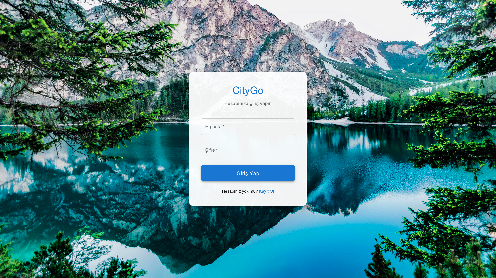
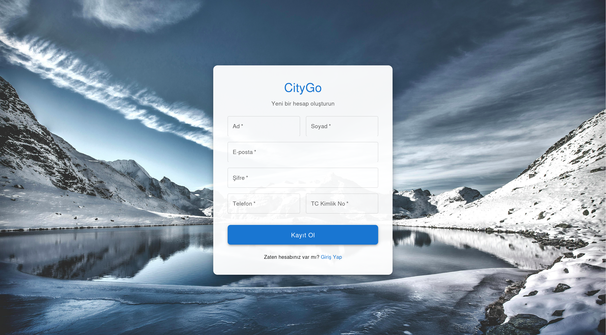
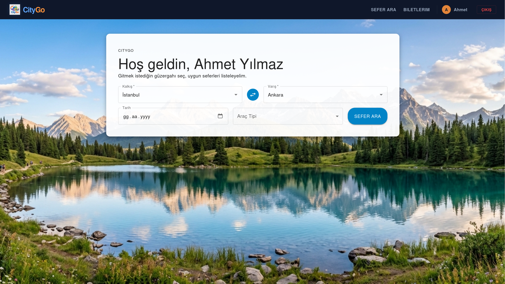
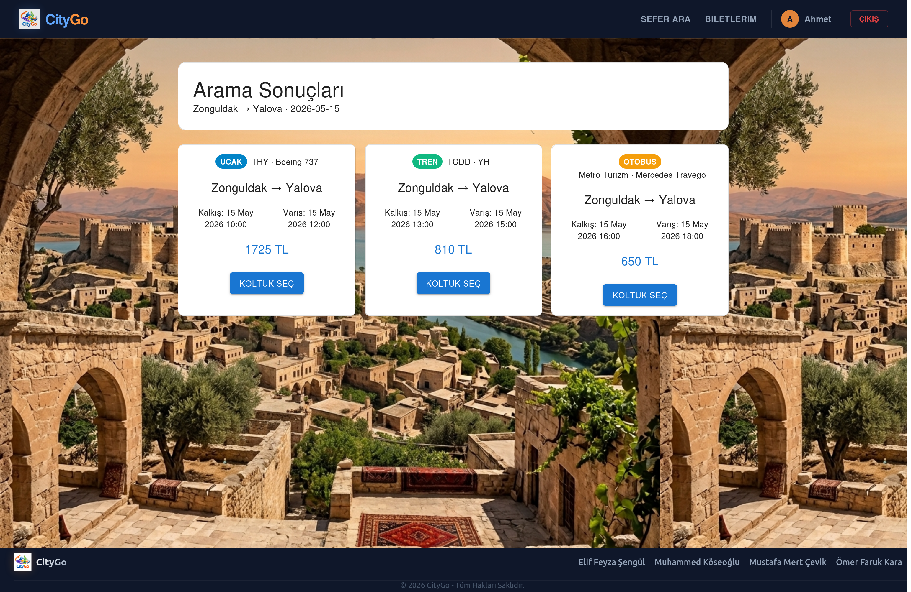
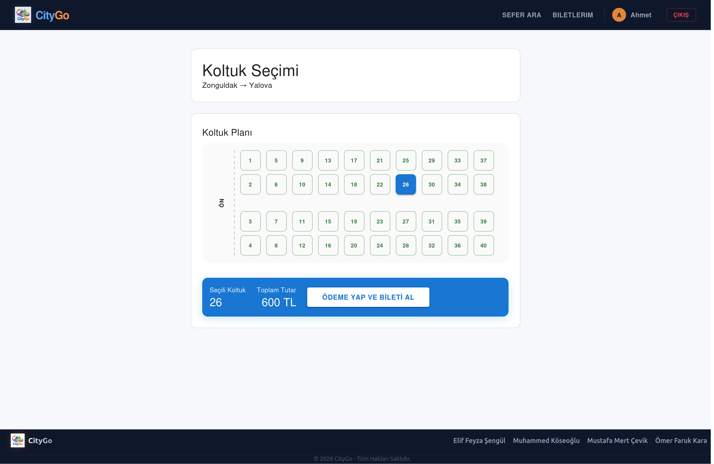
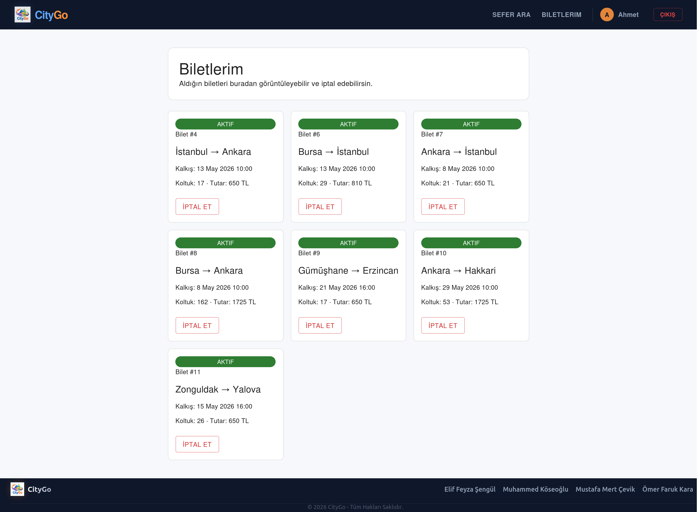
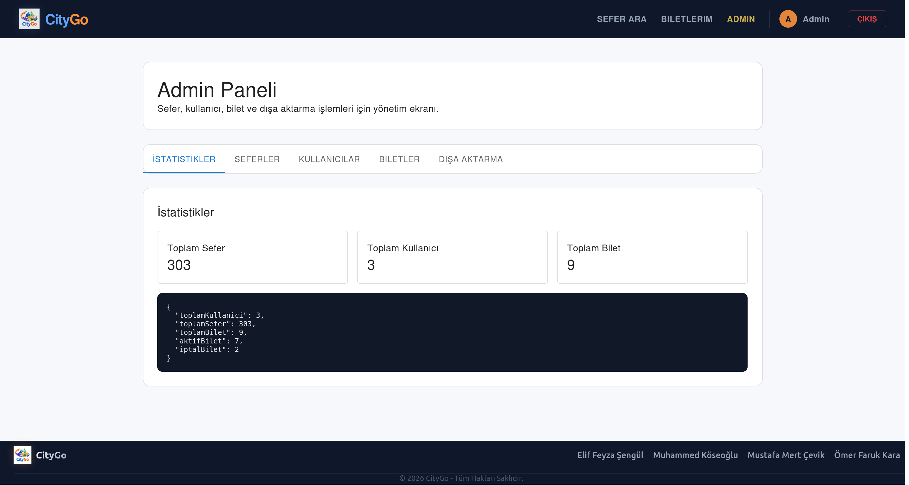
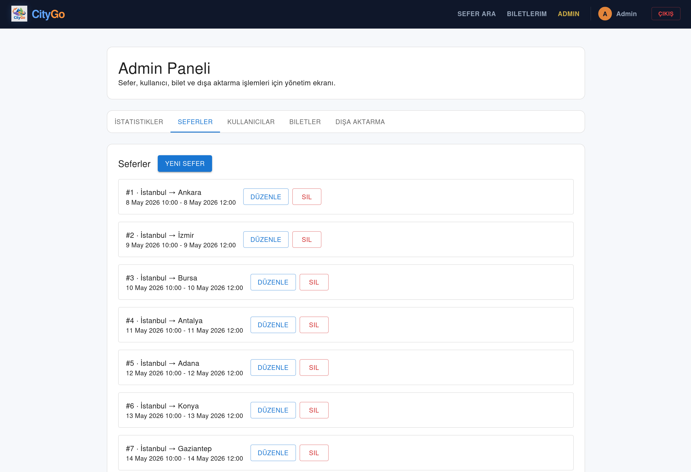

<div align="center">


# 🚌 CityGo

### Akıllı Ulaşım ve Rezervasyon Sistemi

[](https://openjdk.org/)
[](https://spring.io/projects/spring-boot)
[](https://react.dev/)
[](https://mui.com/)
[](https://www.h2database.com/)
[](LICENSE)

Farklı ulaşım türlerini (✈️ uçak, 🚆 tren, 🚌 otobüs) tek bir platformda birleştiren, Java tabanlı full-stack web uygulaması.

[Başlarken](#-başlarken) •
[Özellikler](#-özellikler) •
[Görseller](#-uygulama-görselleri) •
[Teknolojiler](#-kullanılan-teknolojiler) •
[Mimari](#-mimari-tasarım) •
[API](#-api-endpoints) •
[Ekip](#-proje-ekibi)

</div>

---

## 📖 Proje Hakkında

**CityGo**, CENG106 Nesne Yönelimli Programlama dersi kapsamında geliştirilen bir akıllı ulaşım ve bilet rezervasyon sistemidir. Kullanıcılar bu platform üzerinden:

- 🔍 Farklı ulaşım türleri arasında sefer arayabilir ve filtreleyebilir
- 💺 Görsel koltuk haritası üzerinden koltuk seçimi yapabilir
- 🎫 Bilet satın alabilir, görüntüleyebilir ve iptal edebilir
- 📊 Yöneticiler seferleri, araçları ve rezervasyonları sistem üzerinden yönetebilir

Proje, OOP'nin beş temel prensibini (Kalıtım, Kapsülleme, Çok Biçimlilik, Soyutlama, Hata Yönetimi) gerçek dünya senaryolarına uygulayarak **modüler ve sürdürülebilir** bir yazılım mimarisi sunmayı amaçlamaktadır.

---

## 👥 Proje Ekibi

| Ad Soyad | Öğrenci No | Görevler |
|----------|------------|----------|
| **Mustafa Mert Çevik** | 24118080086 | Ulaşım araçları modelleri, sefer arama API'si, seed data |
| **Muhammed Köseoğlu** | 24118080049 | Kullanıcı sistemi, auth API, admin paneli (backend), proje yönetimi |
| **Ömer Faruk Kara** | 24118080064 | React frontend geliştirme, UI/UX, koltuk seçim ekranı, export |
| **Elif Feyza Şengül** | 25118080004 | Bilet/rezervasyon sistemi, exception handling |

> **Ders:** CENG106 — Nesne Yönelimli Programlama<br>
> **Şube:** 1. Şube

---

## ✨ Özellikler

### Kullanıcı (Yolcu) Özellikleri
| Özellik | Açıklama |
|---------|----------|
| 🔐 Kayıt & Giriş | Email ve şifre ile güvenli kullanıcı kimlik doğrulama |
| 🔍 Sefer Arama | Kalkış/varış noktası, tarih ve araç tipi ile filtreleme |
| 💺 Koltuk Seçimi | Görsel koltuk haritası üzerinden interaktif seçim |
| 🎫 Bilet Yönetimi | Bilet satın alma, görüntüleme ve iptal etme |

### Yönetici (Admin) Özellikleri
| Özellik | Açıklama |
|---------|----------|
| 📋 Sefer Yönetimi | Sefer ekleme, güncelleme ve silme (CRUD) |
| 👥 Kullanıcı Listesi | Sistemdeki tüm kullanıcıları görüntüleme |
| 🎫 Bilet Yönetimi | Tüm rezervasyonları görüntüleme ve yönetme |
| 📈 İstatistikler | Dashboard üzerinden anlık istatistikler |
| 📤 Dışa Aktarma | Bilet verilerini JSON ve CSV formatında export etme |

---

## 📸 Uygulama Görselleri

Uygulamanın temel kullanıcı ve yönetici akışları aşağıdaki ekran görüntülerinde görülebilir.

<table>
  <tr>
    <td width="50%">
      <strong>Giriş Ekranı</strong><br>
      
    </td>
    <td width="50%">
      <strong>Kayıt Ekranı</strong><br>
      
    </td>
  </tr>
  <tr>
    <td width="50%">
      <strong>Sefer Arama</strong><br>
      
    </td>
    <td width="50%">
      <strong>Arama Sonuçları</strong><br>
      
    </td>
  </tr>
  <tr>
    <td width="50%">
      <strong>Koltuk Seçimi</strong><br>
      
    </td>
    <td width="50%">
      <strong>Biletlerim</strong><br>
      
    </td>
  </tr>
  <tr>
    <td width="50%">
      <strong>Admin Paneli</strong><br>
      
    </td>
    <td width="50%">
      <strong>Sefer Yönetimi</strong><br>
      
    </td>
  </tr>
</table>

---

## 🛠 Kullanılan Teknolojiler

### Backend
| Teknoloji | Versiyon | Kullanım Amacı |
|-----------|----------|----------------|
| Java | 17 | Backend programlama dili |
| Spring Boot | 3.2.5 | REST API geliştirme, bağımlılık yönetimi |
| Spring Data JPA (Hibernate) | — | Nesne-ilişkisel eşleme (ORM) |
| H2 Database | 2.x | Gömülü ilişkisel veritabanı (dosya tabanlı) |
| Maven | — | Bağımlılık ve derleme yönetimi |
| Spring Security Crypto | — | BCrypt ile şifre hashleme |

### Frontend
| Teknoloji | Versiyon | Kullanım Amacı |
|-----------|----------|----------------|
| React | 19.2.x | Kullanıcı arayüzü geliştirme |
| MUI (Material UI) | 9.x | Hazır, profesyonel UI bileşenleri |
| Vite | 8.x | Geliştirme sunucusu ve derleme |
| Axios | 1.15.x | REST API istekleri |
| React Router | 7.x | Sayfa yönlendirme ve route guard yapısı |

### Araçlar
| Araç | Kullanım Amacı |
|------|----------------|
| Git & GitHub | Versiyon kontrolü ve iş birliği |
| IntelliJ IDEA / VS Code | Kod geliştirme ortamı |
| Postman | API test etme |
| H2 Console | Gömülü veritabanı yönetim arayüzü |

---

## 🏗 Mimari Tasarım

Proje, **katmanlı mimari (Layered Architecture)** prensibiyle tasarlanmıştır. Frontend ve backend birbirinden bağımsız iki ayrı uygulama olarak geliştirilmiş olup, aralarındaki iletişim REST API üzerinden JSON formatında sağlanmaktadır.

```
┌──────────────────────────────────────────────────┐
│               KULLANICI (Tarayıcı)               │
│  ┌───────────────────────────────────────────┐   │
│  │         React + MUI (Frontend)            │   │
│  │  Sayfalar: Giriş, Kayıt, Ana Sayfa,       │   │
│  │  Arama Sonuçları, Koltuk Seçimi,          │   │
│  │  Biletlerim, Admin Paneli                 │   │
│  └─────────────────┬─────────────────────────┘   │
└────────────────────┼─────────────────────────────┘
                     │ REST API (HTTP/JSON)
┌────────────────────┼─────────────────────────────┐
│  ┌─────────────────▼─────────────────────────┐   │
│  │  Controller Katmanı (REST Endpoints)      │   │
│  └─────────────────┬─────────────────────────┘   │
│  ┌─────────────────▼─────────────────────────┐   │
│  │  Service Katmanı (İş Mantığı)             │   │
│  │  Interfaces: IRezervasyon, IAranabilir    │   │
│  └─────────────────┬─────────────────────────┘   │
│  ┌─────────────────▼─────────────────────────┐   │
│  │  Repository Katmanı (Spring Data JPA)     │   │
│  └─────────────────┬─────────────────────────┘   │
│  ┌─────────────────▼─────────────────────────┐   │
│  │      H2 Veritabanı (Dosya Tabanlı)        │   │
│  └───────────────────────────────────────────┘   │
│               SUNUCU (Spring Boot)               │
└──────────────────────────────────────────────────┘
```

---

## 🧬 OOP Prensipleri

Bu projede Nesne Yönelimli Programlamanın temel prensipleri şu şekilde uygulanmıştır:

### 1. Kalıtım (Inheritance)
- `UlasimAraci` abstract sınıfından `Ucak`, `Tren`, `Otobus` alt sınıfları türetilmiştir
- `Kullanici` abstract sınıfından `Yolcu` ve `Admin` sınıfları miras almaktadır

### 2. Kapsülleme (Encapsulation)
- Tüm sınıf alanları `private` erişim belirteci ile tanımlanmıştır
- Dış erişim yalnızca `getter` ve `setter` metotları üzerinden sağlanmaktadır

### 3. Çok Biçimlilik (Polymorphism)
- **Overriding:** Her ulaşım aracı kendi fiyat hesaplama algoritmasını (`hesaplaToplamFiyat()`) geçersiz kılmaktadır
- **Overloading:** Sefer arama metodu farklı parametre kombinasyonlarıyla aşırı yüklenmiştir

### 4. Soyutlama (Abstraction)
- `UlasimAraci` ve `Kullanici` abstract sınıfları tanımlanmıştır
- `IRezervasyon`, `IAranabilir` ve `IExportable` interface'leri kullanılmıştır

### 5. Hata Yönetimi (Exception Handling)
- Özel exception sınıfları tanımlanmıştır (ör. geçersiz tarih, dolu kapasite)
- Merkezi `GlobalExceptionHandler` ile tutarlı hata yönetimi sağlanmıştır

### 6. Kimlik Doğrulama ve Veri Güvenliği
- Şifreler veritabanında düz metin tutulmaz; BCrypt ile hashlenir
- Eski SHA-256 formatındaki kayıtlar başarılı girişten sonra BCrypt formatına taşınır
- Auth endpointleri DTO ile çalışır ve response içinde şifre/hash bilgisi dönmez
- Admin endpointlerinde frontend guard'a ek olarak backend tarafında `X-User-Id` ile admin kontrolü yapılır

---

## 📁 Proje Yapısı

```
CityGo/
├── backend/                          # Spring Boot Backend
│   ├── src/main/java/com/citygo/
│   │   ├── model/                    # Entity sınıfları
│   │   │   ├── UlasimAraci.java      # Abstract üst sınıf
│   │   │   ├── Ucak.java
│   │   │   ├── Tren.java
│   │   │   ├── Otobus.java
│   │   │   ├── Kullanici.java        # Abstract üst sınıf
│   │   │   ├── Yolcu.java
│   │   │   ├── Admin.java
│   │   │   ├── Sefer.java
│   │   │   ├── Bilet.java
│   │   │   ├── Koltuk.java
│   │   │   ├── BiletDurumu.java      # Enum
│   │   │   └── KoltukTipi.java       # Enum
│   │   ├── controller/               # REST Controller'lar
│   │   │   ├── AuthController.java
│   │   │   ├── SeferController.java
│   │   │   ├── BiletController.java
│   │   │   ├── AdminController.java
│   │   │   └── ExportController.java
│   │   ├── dto/                      # Request/response DTO sınıfları
│   │   │   ├── AuthResponse.java
│   │   │   ├── LoginRequest.java
│   │   │   ├── RegisterRequest.java
│   │   │   ├── CreateTicketRequest.java
│   │   │   └── TripRequest.java
│   │   ├── service/                  # İş mantığı katmanı
│   │   │   ├── KullaniciService.java
│   │   │   ├── AramaService.java
│   │   │   ├── RezervasyonService.java
│   │   │   └── ExportService.java
│   │   ├── repository/               # Veri erişim katmanı
│   │   ├── interfaces/               # Interface tanımları
│   │   │   ├── IRezervasyon.java
│   │   │   ├── IAranabilir.java
│   │   │   └── IExportable.java
│   │   └── exception/                # Özel exception sınıfları
│   ├── src/main/resources/
│   │   └── application.properties    # Uygulama konfigürasyonu
│   └── pom.xml                       # Maven bağımlılıkları
│
├── frontend/                         # React Frontend
│   ├── src/
│   │   ├── components/               # Yeniden kullanılabilir bileşenler
│   │   ├── pages/                    # Sayfa bileşenleri
│   │   │   ├── LoginPage.jsx
│   │   │   ├── RegisterPage.jsx
│   │   │   ├── HomePage.jsx
│   │   │   ├── SearchResultsPage.jsx
│   │   │   ├── SeatSelectionPage.jsx
│   │   │   ├── MyTicketsPage.jsx
│   │   │   ├── AdminPanel.jsx
│   │   │   └── NotFound.jsx
│   │   ├── services/                 # API çağrıları
│   │   ├── App.jsx
│   │   └── main.jsx
│   ├── package.json
│   └── vite.config.js
│
├── docs/                            # Raporlar, roadmap ve sunum dosyaları
│   └── screenshots/                 # README için uygulama ekran görüntüleri
├── README.md                         # Bu dosya
└── LICENSE                           # MIT Lisansı
```

---

## 🚀 Başlarken

### Ön Gereksinimler

Aşağıdaki yazılımların sisteminizde kurulu olduğundan emin olun:

- **Java 17** veya üstü → [İndir](https://adoptium.net/)
- **Maven** → [İndir](https://maven.apache.org/download.cgi)
- **Node.js 18+** ve **npm** → [İndir](https://nodejs.org/)
- **Git** → [İndir](https://git-scm.com/)

### Kurulum

#### 1. Projeyi klonlayın

```bash
git clone https://github.com/<kullanici-adi>/CityGo.git
cd CityGo
```

#### 2. Backend'i çalıştırın

```bash
cd backend
mvn clean install
mvn spring-boot:run
```

> Backend varsayılan olarak `http://localhost:8080` adresinde çalışacaktır.  
> H2 Console: `http://localhost:8080/h2-console`
> Veritabanı dosyası aynı anda başka bir Java/H2 süreci tarafından tutuluyorsa o süreci kapatın.

#### 3. Frontend'i çalıştırın

Yeni bir terminal açın:

```bash
cd frontend
npm install
npm run dev
```

> Frontend varsayılan olarak `http://localhost:5173` adresinde çalışacaktır.
> API adresini değiştirmek için `frontend/.env.example` dosyasını `.env` olarak kopyalayıp `VITE_API_BASE_URL` değerini güncelleyin.

Opsiyonel `.env` kurulumu:

```bash
cd frontend
cp .env.example .env
```

### Varsayılan Kullanıcılar (Seed Data)

| Rol | Email | Şifre |
|-----|-------|-------|
| Admin | admin@citygo.com | admin123 |
| Yolcu | yolcu@citygo.com | yolcu123 |

> ⚠️ Seed data yalnızca ilgili tablolar boşsa eklenir; uygulama yeniden başladığında mevcut kullanıcı, bilet ve seferler silinmez.

---

## 📡 API Endpoints

### Kimlik Doğrulama (Auth)
| Metot | Endpoint | Açıklama |
|-------|----------|----------|
| `POST` | `/api/auth/register` | Yeni kullanıcı kaydı |
| `POST` | `/api/auth/login` | Kullanıcı girişi |
| `POST` | `/api/auth/logout` | Çıkış işlemi |

### Sefer İşlemleri
| Metot | Endpoint | Açıklama |
|-------|----------|----------|
| `GET` | `/api/seferler/ara` | Sefer arama (query parametreleri ile) |
| `GET` | `/api/seferler/{id}` | Sefer detayı |
| `GET` | `/api/seferler/{id}/koltuklar` | Sefere ait koltuklar |

### Bilet İşlemleri
| Metot | Endpoint | Açıklama |
|-------|----------|----------|
| `POST` | `/api/biletler` | Bilet satın alma |
| `GET` | `/api/biletler/benim` | Kullanıcının biletleri |
| `PUT` | `/api/biletler/{id}/iptal` | Bilet iptal etme |

### Admin İşlemleri
| Metot | Endpoint | Açıklama |
|-------|----------|----------|
| `GET` | `/api/admin/seferler` | Tüm seferleri listele |
| `GET` | `/api/admin/araclar` | Tüm ulaşım araçlarını listele |
| `POST` | `/api/admin/seferler` | Yeni sefer ekle |
| `PUT` | `/api/admin/seferler/{id}` | Sefer güncelle |
| `DELETE` | `/api/admin/seferler/{id}` | Sefer sil |
| `GET` | `/api/admin/kullanicilar` | Tüm kullanıcılar |
| `GET` | `/api/admin/biletler` | Tüm biletler |
| `GET` | `/api/admin/istatistikler` | Dashboard istatistikleri |

### Dışa Aktarma (Export)
| Metot | Endpoint | Açıklama |
|-------|----------|----------|
| `GET` | `/api/export/biletler/json` | Bilet verilerini JSON olarak dışa aktar |
| `GET` | `/api/export/biletler/csv` | Bilet verilerini CSV olarak dışa aktar |

---

## 🗃 Veritabanı

H2 gömülü ilişkisel veritabanı, **dosya tabanlı modda** çalışmaktadır. Veriler proje dizininde `.mv.db` dosyası olarak saklanır. Kurulum gerektirmez — Spring Boot ile otomatik olarak başlar.

### Temel Tablolar

| Tablo | Açıklama |
|-------|----------|
| `kullanicilar` | Yolcu ve Admin bilgileri |
| `ulasimaraci` | Uçak, Tren, Otobüs bilgileri |
| `seferler` | Sefer bilgileri |
| `koltuklar` | Koltuk bilgileri ve durumları |
| `biletler` | Bilet/Rezervasyon bilgileri |

### H2 Console Erişimi

Uygulama çalışırken tarayıcınızdan şu adrese giderek veritabanını inceleyebilirsiniz:

```
URL:      http://localhost:8080/h2-console
JDBC URL: jdbc:h2:file:./data/citygo;AUTO_SERVER=TRUE
Username: sa
Password: (boş bırakın)
```

---

## 🧪 Test

```bash
# Backend unit testlerini çalıştırma
cd backend
mvn test

# Frontend derlemesini kontrol etme
cd frontend
npm run build
```

> Frontend bağımlılık güvenliği için `cd frontend && npm audit` komutu da kullanılabilir.

---

## 📄 Lisans

Bu proje [MIT Lisansı](LICENSE) kapsamında lisanslanmıştır.

---

<div align="center">

**CityGo** ile yolculuğunuzu planlayın.

*CENG106 Nesne Yönelimli Programlama — 2026*

</div>
